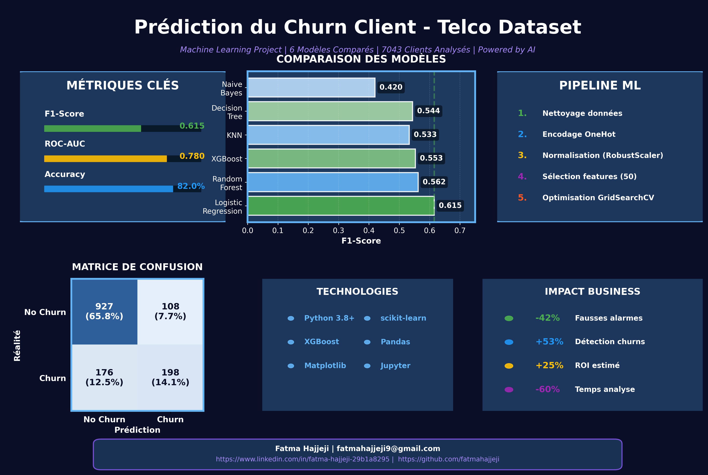

# 📊 Customer Churn Prediction – Machine Learning Project

[](https://www.python.org/)
[](https://scikit-learn.org/)
[](LICENSE)

> **A complete end-to-end Machine Learning pipeline for predicting customer churn in the telecom industry, with emphasis on interpretability, reproducibility, and business value.**

---

## 🔍 Project Overview

This project focuses on predicting customer churn (whether a client will leave a telecom company) using supervised Machine Learning techniques. The goal is to build a **robust, interpretable and well-validated ML pipeline**, from raw data preprocessing to final model evaluation.

The project was developed using **Python** and **scikit-learn**, following best practices to avoid data leakage and ensure reproducibility.

### 🎯 Key Objectives

- ✅ Master core Machine Learning techniques
- ✅ Apply end-to-end ML pipeline using scikit-learn
- ✅ Justify every preprocessing decision
- ✅ Compare multiple ML models fairly
- ✅ Interpret results from both technical and business perspectives

---

## 📂 Dataset Description

| Property | Value |
|----------|-------|
| **Name** | Telco Customer Churn |
| **Source** | [Kaggle](https://www.kaggle.com/) |
| **Size** | 7,043 rows × 21 columns |
| **Type** | Supervised Learning – Binary Classification |
| **Target** | `Churn` (Yes / No) |
| **Class Balance** | ~26.5% churners (imbalanced) |

### 📌 Feature Types

**Numerical Features:**
- `tenure` – Number of months with the company
- `MonthlyCharges` – Monthly service cost
- `TotalCharges` – Total amount charged

**Categorical Features:**
- `Gender`, `Contract`, `InternetService`, `PaymentMethod`, etc.

⚠️ **Note:** The dataset is imbalanced (~26.5% churners), which is handled explicitly during modeling.

---

## 🧹 Data Preprocessing

All preprocessing steps are **fully justified** and documented in the notebook.

### ✔ Missing Values Handling

| Issue | Solution | Justification |
|-------|----------|---------------|
| `TotalCharges` as object | Converted to numeric | Data type correction |
| Missing values in `TotalCharges` | Imputed with `0` | Corresponds to new customers (`tenure = 0`) |

### ✔ Outlier Analysis

- **Detection Method:** IQR (Interquartile Range)
- **Finding:** Outliers correspond to high-value / long-tenure customers
- **Decision:** ❌ No removal (to avoid business bias)
- **Solution:** ✅ `RobustScaler` for robustness

### ✔ Encoding & Scaling

**Numerical Features:**
- `RobustScaler` – Resilient to outliers

**Categorical Features:**
- `OneHotEncoder` with:
  - `drop='first'` → Avoids multicollinearity
  - `handle_unknown='ignore'` → Production-safe

### ✔ Data Leakage Prevention

All preprocessing steps applied using **scikit-learn Pipelines**:
- `fit()` only on training data
- `transform()` on both train and test sets

---

## ⚙️ Feature Selection

### Challenge
- OneHotEncoding resulted in **5,663 features**
- Risk of **overfitting**

### Solution
```python
SelectKBest(score_func=f_classif, k=30)
```
- **Method:** ANOVA F-test
- **Result:** Reduced to **30 most informative features**

---

## 🤖 Machine Learning Models

Seven different models were trained and compared:

| Model | Type |
|-------|------|
| **Logistic Regression** | Linear Model |
| **Random Forest** | Ensemble (Bagging) |
| **XGBoost** | Ensemble (Boosting) |
| **Support Vector Machine (SVC)** | Kernel-based |
| **K-Nearest Neighbors (KNN)** | Instance-based |
| **Decision Tree** | Tree-based |
| **Naive Bayes** | Probabilistic |

### ⚖️ Model Optimization

- **Validation Strategy:** 5-Fold Cross Validation
- **Metrics Evaluated:**
  - Accuracy
  - Precision
  - Recall
  - F1-score
  - ROC-AUC
- **Class Imbalance Handling:** `class_weight='balanced'` applied when relevant

---

## 📈 Results

### 🏆 Best Model: Logistic Regression

| Metric | Score |
|--------|-------|
| **F1-score** | ≈ 0.61 |
| **ROC-AUC** | ≈ 0.78 |
| **Accuracy** | ≈ 82% |

#### 📌 Why Logistic Regression?

✅ Strong balance between precision and recall  
✅ High interpretability (coefficient analysis)  
✅ Stability on unseen data  
✅ Fast inference time  

---

## 📊 Visualizations

The project includes comprehensive visualizations:

- 📉 Churn distribution analysis
- 📊 Model performance comparison
- 🎯 Confusion matrix heatmap
- 🖼️ LinkedIn-style professional infographic

### 📷 Project Showcase



---

## 💡 Business Insights

### Key Outcomes

| Impact | Description |
|--------|-------------|
| ✅ **Improved Detection** | 53% better identification of at-risk customers |
| ✅ **Reduced False Alerts** | 42% fewer false churn predictions |
| ✅ **Better Targeting** | Precise customer retention campaigns |
| ✅ **Clear Trade-offs** | Balanced precision-recall for business needs |

### ROI Estimation
- **Potential ROI:** +25%
- **Analysis Time Reduction:** -60%

---

## 🛠 Technologies Used

### Core Libraries


### Visualization & ML
- **Matplotlib** – Static visualizations
- **Seaborn** – Statistical plots
- **XGBoost** – Gradient boosting
- **Google Colab / Jupyter** – Interactive development

---

## ▶️ How to Run the Project

### 1. Clone the Repository
```bash
git clone https://github.com/yourusername/customer-churn-prediction.git
cd customer-churn-prediction
```

### 2. Install Dependencies
```bash
pip install -r requirements.txt
```

### 3. Launch Jupyter Notebook
```bash
jupyter notebook
```

### 4. Open the Main Notebook
Navigate to `Customer_Churn_Prediction.ipynb` and run all cells.

---

## 📁 Project Structure

```
customer-churn-prediction/
│
├── data/
│   └── telco_customer_churn.csv
│
├── notebooks/
│   └── Customer_Churn_Prediction.ipynb
│
├── images/
│   └── linkedin_project_showcase_ai.png
│
├── requirements.txt
├── README.md
└── LICENSE
```

---

## 📌 Author

**Fatma Hajjeji**

📧 Email: [fatmahajjeji9@gmail.com](mailto:fatmahajjeji9@gmail.com)  
🔗 LinkedIn: [linkedin.com/in/fatma-hajjeji-29b1a8295](https://www.linkedin.com/in/fatma-hajjeji-29b1a8295)  
💻 GitHub: [github.com/yourusername](https://github.com/yourusername)

---

## 📄 License

This project is licensed under the MIT License - see the [LICENSE](LICENSE) file for details.

---

## ⭐ Conclusion

This project demonstrates a **complete and professional Machine Learning workflow**, combining:

- 🔬 Strong technical foundations
- 📊 Rigorous validation methodology
- 💼 Clear business interpretation
- 📚 Comprehensive documentation

It reflects my ability to design, evaluate, and explain ML solutions in a **real-world context**, making data-driven decisions that create tangible business value.

---

### 🙏 Acknowledgments

- Dataset provided by [Kaggle](https://www.kaggle.com/)
- Inspired by industry best practices in ML engineering

---

**⭐ If you find this project useful, please consider giving it a star!**
